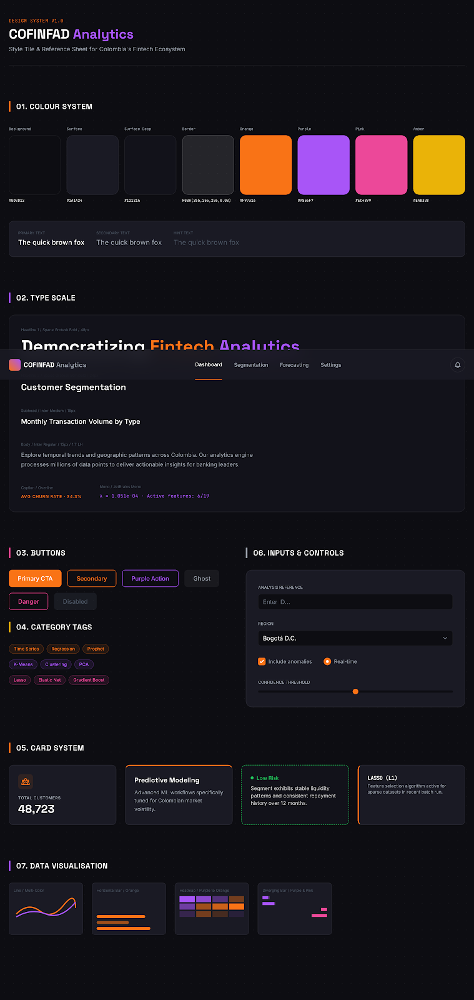
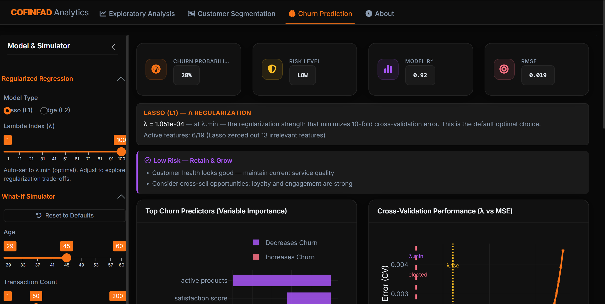
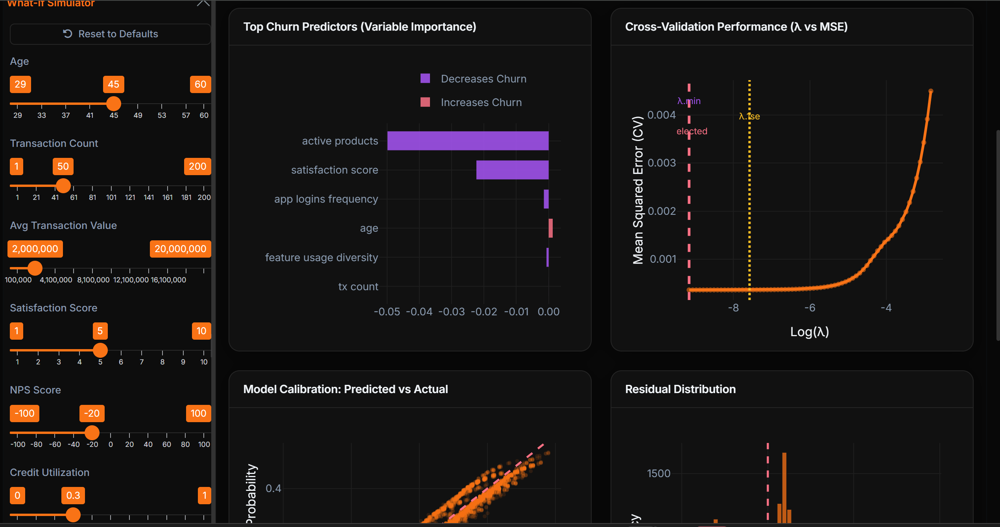
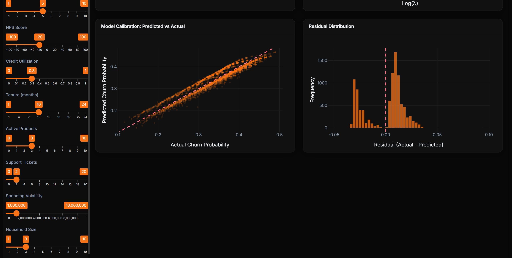

```{=html}
<style>
p {
  text-align: justify;
}
body, 
body p, 
body h1, 
body h2, 
body h3, 
body h4, 
body h5, 
body h6, 
body li {
  color: #000 !important;
}
</style>
```

# 1. Overview

## 1.1 Project Context

Our team project, **COFINFAD Analytics** (Colombia's Fintech Financial Advisory Dashboard), is a visual analytics Shiny application designed to democratize fintech data for Colombia's banking sector. The application comprises three analytical modules:

-   **Module 1: Exploratory & Confirmatory Analysis** (by Lin Yan)
-   **Module 2: Customer Segmentation** (by Ji Guofang)
-   **Module 3: Churn Prediction & What-If Simulator** (by Nguyen Trong Nhan, this prototype)

This take-home exercise focuses on **Module 3**, which uses regularized regression (Lasso and Ridge) to predict customer churn probability, and provides a real-time What-If simulator that lets bank practitioners adjust customer attributes and instantly observe how predicted churn risk changes.

## 1.2 Dataset

The project uses two datasets:

-   **Customer master table**: 48,723 records x 54 variables spanning demographics (age, gender, location, income bracket), product holdings (savings account, credit card, personal loan, investment account, insurance), transaction summaries, satisfaction scores, and a continuous target variable `churn_probability` (0 to 1).

-   **Transactions log**: \~3.16 million individual transaction events with date, amount, type (Transfer, Withdrawal, Payment, Deposit), and customer ID linkage.

## 1.3 Analytical Questions

The Churn Prediction module addresses the following:

1.  **Which customer attributes are the strongest predictors of churn?** Answered via variable importance from regularized regression coefficients.

2.  **How well can we predict churn probability using observable customer features?** Answered via model evaluation metrics (R², RMSE, CV MSE) and diagnostic plots.

3.  **How does regularization strength affect prediction accuracy and model complexity?** Answered via cross-validation performance curves and regularization path visualisation.

4.  **How would changing a customer's attributes affect their predicted churn risk?** Answered via the What-If Simulator with real-time predictions.

5.  **What actionable recommendations can we derive from the model?** Answered via data-driven risk classification and automatic business recommendations.

# 2. Packages

In the code chunk below, `p_load()` of **pacman** package is used to load the R packages required for this prototype module.

```{r}
#| code-fold: false
pacman::p_load(
  tidyverse,    # Data wrangling (dplyr, tidyr, ggplot2, readr, etc.)
  glmnet,       # Regularized regression (Lasso L1 / Ridge L2)
  plotly,       # Interactive charts
  knitr,        # Table rendering
  scales,       # Number formatting (percent, comma, etc.)
  viridis,      # Perceptually uniform colour palettes
  lubridate,    # Date parsing (floor_date, wday, etc.)
  patchwork     # Composing multiple ggplots
)
```

```{r}
#| code-fold: false
# Uniform theme for all ggplot charts
theme_proto <- function(base_size = 13) {
  theme_minimal(base_size = base_size, base_family = "sans") %+replace%
    theme(
      plot.title    = element_text(face = "bold", hjust = 0.5, size = base_size + 2,
                                   margin = margin(b = 8)),
      plot.subtitle = element_text(hjust = 0.5, color = "gray50", size = base_size - 1,
                                    margin = margin(b = 12)),
      axis.title.x  = element_text(size = base_size, margin = margin(t = 10)),
      axis.title.y  = element_text(size = base_size, margin = margin(r = 10)),
      axis.text     = element_text(size = base_size - 2),
      strip.text    = element_text(face = "bold", size = base_size - 1),
      legend.text   = element_text(size = base_size - 2),
      legend.title  = element_text(size = base_size - 1),
      plot.margin   = margin(t = 15, r = 15, b = 15, l = 15)
    )
}
```

::: callout-note
## Package Evaluation

All packages listed above are available on CRAN and were verified as of March 2026:

| Package | Version | CRAN | Purpose |
|----|----|----|----|
| `glmnet` | 4.1+ | ✓ | Regularized regression (Lasso / Ridge) via coordinate descent |
| `plotly` | 4.10+ | ✓ | Interactive web-based visualisations with hover, zoom, pan |
| `patchwork` | 1.2+ | ✓ | Composing multiple ggplots into multi-panel figures |
| `tidyverse` | 2.0+ | ✓ | Data wrangling and ggplot2 |
| `lubridate` | 1.9+ | ✓ | Date/time manipulation |
| `scales` | 1.3+ | ✓ | Axis label formatting |
| `viridis` | 0.6+ | ✓ | Colour-blind-friendly palettes |

: Package Availability on CRAN {.striped .hover}

In the final Shiny app, additional packages such as `shiny`, `bslib`, `shinycssloaders`, `DT`, `leaflet`, and `sf` are used for the UI framework and spatial features.
:::

# 3. Data Preparation

## 3.1 Loading the Data

The project uses two CSV files as input: a customer master table and a granular transactions log.

```{r}
#| code-fold: false
customers_raw    <- read.csv("data/customer_data (1).csv", stringsAsFactors = FALSE)
transactions_raw <- read.csv("data/transactions_data (1).csv", stringsAsFactors = FALSE)

cat("Customers:   ", nrow(customers_raw), "rows,", ncol(customers_raw), "cols\n")
cat("Transactions:", nrow(transactions_raw), "rows,", ncol(transactions_raw), "cols\n")
```

## 3.2 Cleaning and Feature Engineering

The data preparation pipeline involves type conversion, grouped imputation, and engineered features. Each step is annotated below.

```{r}
customers <- customers_raw %>%
  mutate(
    # --- Date conversion ---
    first_tx = as.Date(first_tx),
    last_tx  = as.Date(last_tx),
    last_survey_date     = as.Date(last_survey_date),
    last_transaction_date = as.Date(last_transaction_date),
    first_transaction_date = as.Date(first_transaction_date),
    
    # --- Boolean conversion (CSV stores as "True"/"False" strings) ---
    savings_account      = (savings_account == "True"),
    credit_card          = (credit_card == "True"),
    personal_loan        = (personal_loan == "True"),
    investment_account   = (investment_account == "True"),
    insurance_product    = (insurance_product == "True"),
    bill_payment_user    = (bill_payment_user == "True"),
    auto_savings_enabled = (auto_savings_enabled == "True"),
    
    # --- Derived fields ---
    city       = trimws(sub(",.*", "", location)),
    department = trimws(sub(".*,", "", location)),
    age_group  = cut(age, 
                     breaks = c(17, 25, 35, 45, 55, 65, 100),
                     labels = c("18-25","26-35","36-45","46-55","56-65","65+")),
    
    # --- Factor ordering ---
    income_bracket    = factor(income_bracket, 
                               levels = c("Low","Medium","High","Very High")),
    customer_segment  = factor(customer_segment, 
                               levels = c("inactive","occasional","regular","power")),
    clv_segment       = factor(clv_segment, 
                               levels = c("Bronze","Silver","Gold","Platinum")),
    feedback_sentiment = factor(feedback_sentiment, 
                                levels = c("Negative","Neutral","Positive")),
    
    # --- Churn risk categories (data-driven thresholds) ---
    churn_risk = factor(
      case_when(
        churn_probability < quantile(churn_probability, 0.25, na.rm = TRUE) ~ "Low",
        churn_probability < quantile(churn_probability, 0.75, na.rm = TRUE) ~ "Medium",
        TRUE ~ "High"
      ),
      levels = c("Low","Medium","High")
    ),
    
    # --- Numerical features ---
    recency_days    = as.numeric(as.Date("2024-01-01") - last_tx),
    tenure_months   = round(customer_tenure, 1),
    income_numeric  = as.numeric(income_bracket)
  ) %>%
  # --- Grouped median imputation for credit_utilization_ratio ---
  group_by(income_bracket) %>%
  mutate(credit_utilization_ratio = ifelse(
    is.na(credit_utilization_ratio),
    median(credit_utilization_ratio, na.rm = TRUE),
    credit_utilization_ratio
  )) %>%
  ungroup() %>%
  # --- Engineered features ---
  mutate(
    product_diversity_ratio = active_products / 5,
    ticket_resolution_gap   = support_tickets_count * (1 - coalesce(resolved_tickets_ratio, 0))
  )

cat("Missing credit_utilization_ratio after grouped imputation:",
    sum(is.na(customers$credit_utilization_ratio)), "\n")
```

::: callout-tip
## Why Grouped Median Imputation?

Rather than replacing missing `credit_utilization_ratio` values with the global median, we impute within each `income_bracket` group. This is more sensible because credit utilization patterns differ substantially across income levels. A high-income customer with 30% utilization is very different from a low-income customer with the same ratio. Grouped imputation preserves these distributional differences. The code uses `group_by(income_bracket)` followed by `mutate()` with a conditional `ifelse()`, ensuring that only missing values are replaced while observed values remain untouched.
:::

## 3.3 Processing Transactions

The transactions dataset (\~3.16 million rows) provides granular payment-level data. We aggregate it at the per-customer level to derive `spending_volatility`, the standard deviation of each customer's transaction amounts, which captures how erratic a customer's spending behaviour is.

```{r}
# --- Date conversion and weekend flag ---
transactions <- transactions_raw %>%
  mutate(
    date       = as.Date(date),
    month      = floor_date(date, "month"),
    is_weekend = wday(date) %in% c(1, 7)
  )

# --- Per-customer transaction aggregation ---
customer_tx_agg <- transactions %>%
  group_by(customer_id) %>%
  summarise(
    total_amount = sum(amount, na.rm = TRUE),
    avg_amount   = mean(amount, na.rm = TRUE),
    sd_amount    = sd(amount, na.rm = TRUE),
    tx_count     = n(),
    .groups = "drop"
  )

cat("Transaction aggregation complete:", nrow(customer_tx_agg), "customers\n")
```

::: callout-note
## Why Aggregate Transactions?

The raw transactions table has \~65 rows per customer on average. We cannot feed 3.16 million rows directly into a customer-level regression model. Instead, we aggregate per customer and extract `sd_amount` (standard deviation of transaction amounts) as a measure of **spending volatility**. High volatility may signal financial instability or inconsistent engagement, both of which are potential churn indicators. This aggregation step reduces the data from 3.16 million rows to 48,723 rows (one per customer), making it compatible with the customer master table.
:::

## 3.4 Merging Customer and Transaction Data

We join the per-customer transaction aggregation back to the customer master table to create the final analytical dataset.

```{r}
# --- Merge: customer master + transaction-derived features ---
analytics_data <- customers %>%
  left_join(customer_tx_agg %>% select(customer_id, sd_amount), by = "customer_id") %>%
  mutate(
    spending_volatility = coalesce(sd_amount, 0)
  )

cat("Analytics dataset:", nrow(analytics_data), "rows,", ncol(analytics_data), "cols\n")
cat("Spending volatility range:", 
    round(min(analytics_data$spending_volatility)), "to", 
    round(max(analytics_data$spending_volatility)), "\n")
```

## 3.5 Building the Model Training Dataset

We select 19 numeric features as predictors and `churn_probability` as the target variable. Features are chosen based on their theoretical relevance to customer churn behaviour.

```{r}
model_df <- analytics_data %>%
  select(
    churn_probability,         # Target (continuous, 0-1)
    age, tx_count, avg_tx_value, total_tx_volume,
    satisfaction_score, credit_utilization_ratio, customer_tenure,
    active_products, nps_score, weekend_transaction_ratio,
    support_tickets_count, resolved_tickets_ratio, app_logins_frequency,
    feature_usage_diversity, spending_volatility, household_size,
    failed_transactions, product_diversity_ratio, ticket_resolution_gap
  ) %>%
  drop_na()

cat("Training data:", nrow(model_df), "observations x", 
    ncol(model_df) - 1, "features\n")
```

```{r}
# Separate target and feature matrix
y <- model_df$churn_probability
X <- as.matrix(model_df %>% select(-churn_probability))
```

::: callout-note
## Feature Selection Rationale

The 19 predictors span four domains of customer behaviour:

-   **Transaction activity**: `tx_count`, `avg_tx_value`, `total_tx_volume`, `weekend_transaction_ratio`, `failed_transactions`
-   **Engagement & product adoption**: `active_products`, `app_logins_frequency`, `feature_usage_diversity`, `product_diversity_ratio`
-   **Satisfaction & support**: `satisfaction_score`, `nps_score`, `support_tickets_count`, `resolved_tickets_ratio`, `ticket_resolution_gap`
-   **Demographics & tenure**: `age`, `customer_tenure`, `household_size`, `credit_utilization_ratio`, `spending_volatility`

We intentionally include **all 19 features** rather than pre-selecting a subset, because the Lasso model will automatically perform feature selection by zeroing out irrelevant coefficients. This lets the data decide which features matter.
:::

# 4. Exploratory Data Analysis

Before modelling, it is crucial to understand the distribution of the target variable and the relationships between predictors and churn probability. This section follows the visual analytics principle of **"overview first, zoom and filter, then details-on-demand"** (Shneiderman, 1996).

## 4.1 Target Variable Distribution

```{r}
#| fig-height: 5
#| fig-width: 10

p1 <- ggplot(analytics_data, aes(x = churn_probability)) +
  geom_histogram(bins = 50, fill = "#f97316", alpha = 0.85, 
                 color = "white", linewidth = 0.3) +
  geom_vline(xintercept = median(analytics_data$churn_probability, na.rm = TRUE),
             color = "#a855f7", linetype = "dashed", linewidth = 0.8) +
  geom_vline(xintercept = quantile(analytics_data$churn_probability, 0.25, na.rm = TRUE),
             color = "#fbbf24", linetype = "dotted", linewidth = 0.6) +
  geom_vline(xintercept = quantile(analytics_data$churn_probability, 0.75, na.rm = TRUE),
             color = "#fb7185", linetype = "dotted", linewidth = 0.6) +
  annotate("text", 
           x = median(analytics_data$churn_probability, na.rm = TRUE) + 0.015,
           y = Inf, vjust = 2, hjust = 0,
           label = paste0("Median: ", 
                          round(median(analytics_data$churn_probability, na.rm = TRUE), 3)),
           color = "#a855f7", size = 4, fontface = "bold") +
  annotate("text",
           x = quantile(analytics_data$churn_probability, 0.25, na.rm = TRUE) - 0.015,
           y = Inf, vjust = 3.5, hjust = 1,
           label = "Q25", color = "#fbbf24", size = 3.5) +
  annotate("text",
           x = quantile(analytics_data$churn_probability, 0.75, na.rm = TRUE) + 0.015,
           y = Inf, vjust = 3.5, hjust = 0,
           label = "Q75", color = "#fb7185", size = 3.5) +
  labs(title = "Distribution of Churn Probability",
       subtitle = "Dashed lines mark Q25, Median, and Q75, used as risk classification thresholds",
       x = "Churn Probability", y = "Count") +
  theme_proto()

ggplotly(p1) %>%
  layout(hoverlabel = list(bgcolor = "white"), margin = list(l = 60, r = 40, t = 60, b = 60))
```

::: callout-tip
## Plot Approach

A histogram is the most natural choice for understanding the distribution of a continuous target variable. Three reference lines are drawn: Q25 (amber), Median (purple), and Q75 (pink). These are the exact thresholds used later for risk classification (Low/Medium/High). By annotating these directly on the distribution, the reader can immediately see how the risk tiers partition the population. The plotly conversion allows hovering over bars to see exact counts per bin.
:::

The distribution reveals that churn probability is roughly bell-shaped and centred around 0.28 to 0.30, with a slight right skew. This means most customers fall in the "medium" risk range, with relatively fewer customers at the extreme low and high ends.

## 4.2 Churn Probability by Risk Category

```{r}
#| fig-height: 5
#| fig-width: 10

p2 <- ggplot(analytics_data, aes(x = churn_risk, y = churn_probability, fill = churn_risk)) +
  geom_boxplot(alpha = 0.8, outlier.alpha = 0.3, outlier.size = 0.8, width = 0.5) +
  geom_jitter(alpha = 0.02, size = 0.3, width = 0.15, color = "gray40") +
  scale_fill_manual(values = c("Low" = "#a855f7", "Medium" = "#fbbf24", "High" = "#fb7185")) +
  stat_summary(fun = mean, geom = "point", shape = 18, size = 3.5, color = "white") +
  labs(title = "Churn Probability by Risk Category",
       subtitle = "Diamonds mark the group mean; risk thresholds derived from Q25/Q75",
       x = "Risk Category", 
       y = "Churn Probability") +
  theme_proto() +
  theme(legend.position = "none")

ggplotly(p2) %>%
  layout(hoverlabel = list(bgcolor = "white"), margin = list(l = 60, r = 40, t = 60, b = 60))
```

The box plot confirms that the data-driven risk thresholds (Q25 and Q75) produce well-separated groups with minimal overlap. The Low risk group is concentrated below \~20%, Medium spans roughly 20 to 35%, and High extends from \~35% upward. The white diamonds show group means, which closely align with the medians, indicating symmetric distributions within each tier.

## 4.3 Feature Distributions by Churn Risk

To understand which features differentiate high-churn from low-churn customers, we examine the distribution of key predictors across the three risk categories.

```{r}
#| fig-height: 10
#| fig-width: 12

key_features <- c("satisfaction_score", "active_products", "nps_score",
                   "credit_utilization_ratio", "customer_tenure", 
                   "support_tickets_count", "app_logins_frequency",
                   "spending_volatility")

plot_data <- analytics_data %>%
  select(churn_risk, all_of(key_features)) %>%
  pivot_longer(-churn_risk, names_to = "feature", values_to = "value") %>%
  mutate(feature = gsub("_", " ", feature))

p3 <- ggplot(plot_data, aes(x = churn_risk, y = value, fill = churn_risk)) +
  geom_boxplot(alpha = 0.8, outlier.alpha = 0.1, outlier.size = 0.5) +
  scale_fill_manual(values = c("Low" = "#a855f7", "Medium" = "#fbbf24", "High" = "#fb7185")) +
  facet_wrap(~feature, scales = "free_y", ncol = 4) +
  labs(title = "Feature Distributions Across Churn Risk Categories",
       subtitle = "Identifying which customer attributes differentiate Low, Medium, and High risk groups",
       x = NULL, y = NULL) +
  theme_proto() +
  theme(legend.position = "bottom",
        legend.title = element_blank())

ggplotly(p3) %>%
  layout(hoverlabel = list(bgcolor = "white"),
         legend = list(orientation = "h", y = -0.08, x = 0.5, xanchor = "center"))
```

::: callout-tip
## Plot Approach

Faceted box plots (small multiples) are the most effective technique for comparing multiple feature distributions across groups simultaneously. Each panel uses a free y-axis so that features with different scales (e.g., satisfaction 1 to 10 vs spending volatility in millions) are all readable. The consistent colour coding (purple = Low, amber = Medium, pink = High) reinforces the risk categorisation across all panels.

Key observations:

-   **Satisfaction score** and **active products** show the clearest separation. High-risk customers have noticeably lower values in both, suggesting these are strong churn predictors.
-   **NPS score** decreases sharply for high-risk customers, aligning with the expectation that dissatisfied customers are more likely to churn.
-   **Support tickets** increase for high-risk customers, while **credit utilization** shows only modest differences.
-   **Spending volatility** appears similar across groups at first glance, but the interquartile ranges differ. We will verify its predictive contribution through the model.
:::

## 4.4 Feature Correlation Matrix

Before modelling, we examine inter-feature correlations to identify multicollinearity. When predictors are highly correlated, regularization becomes especially important.

```{r}
#| fig-height: 10
#| fig-width: 11

cor_matrix <- cor(model_df, use = "complete.obs")

# Hierarchical clustering order
hc_order <- hclust(as.dist(1 - abs(cor_matrix)))$order
cor_ordered <- cor_matrix[hc_order, hc_order]

# Convert to long format (lower triangle only)
cor_long <- as.data.frame(as.table(cor_ordered)) %>%
  rename(Var1 = Var1, Var2 = Var2, value = Freq) %>%
  mutate(
    Var1 = factor(Var1, levels = colnames(cor_ordered)),
    Var2 = factor(Var2, levels = colnames(cor_ordered)),
    idx1 = as.numeric(Var1),
    idx2 = as.numeric(Var2)
  ) %>%
  filter(idx1 >= idx2)

p_cor <- ggplot(cor_long, aes(x = Var2, y = Var1, fill = value)) +
  geom_tile(color = "white", linewidth = 0.3) +
  geom_text(aes(label = round(value, 2)), size = 2.8, color = "black") +
  scale_fill_gradient2(low = "#a855f7", mid = "white", high = "#f97316",
                       midpoint = 0, limits = c(-1, 1),
                       name = "Correlation") +
  labs(title = "Feature Correlation Matrix (Hierarchical Clustering Order)",
       x = NULL, y = NULL) +
  theme_proto(base_size = 12) +
  theme(axis.text.x = element_text(angle = 45, hjust = 1, size = 9),
        axis.text.y = element_text(size = 9),
        legend.position = "right",
        panel.grid = element_blank())

p_cor
```

::: callout-tip
## Plot Approach

The `ggplot2` correlation heatmap with `geom_tile()` and hierarchical clustering order groups correlated features together, making patterns easier to spot. The diverging purple-to-orange palette maps negative to positive correlations respectively, while numeric labels provide exact values.

Key findings:

-   **`tx_count` and `total_tx_volume`** are highly correlated (expected, since more transactions lead to higher total volume). This multicollinearity is exactly why we need regularization: OLS would produce unstable coefficients for these two, while Lasso can drop one and Ridge will shrink both proportionally.
-   **`satisfaction_score` and `nps_score`** are moderately correlated. Both measure customer sentiment but from different angles.
-   **`product_diversity_ratio` and `active_products`** are perfectly correlated by construction (`product_diversity_ratio = active_products / 5`). Lasso will zero out one of them.
-   **`churn_probability`** (our target) shows the strongest negative correlations with `active_products`, `satisfaction_score`, and `app_logins_frequency`, confirming our EDA observations.
:::

## 4.5 Key Predictor Relationships with Churn

To further explore the strongest predictors identified in the correlation matrix, we create scatter plots with trend lines.

```{r}
#| fig-height: 6
#| fig-width: 14

p_sat <- ggplot(analytics_data, aes(x = satisfaction_score, y = churn_probability,
                                     color = churn_risk)) +
  geom_jitter(alpha = 0.08, size = 0.5, width = 0.2, height = 0) +
  geom_smooth(method = "loess", se = TRUE, linewidth = 1, color = "#f97316") +
  scale_color_manual(values = c("Low" = "#a855f7", "Medium" = "#fbbf24", "High" = "#fb7185")) +
  labs(title = "Satisfaction Score vs Churn", x = "Satisfaction Score", y = "Churn Probability") +
  theme_proto() +
  theme(legend.position = "none")

p_prod <- ggplot(analytics_data, aes(x = active_products, y = churn_probability,
                                      color = churn_risk)) +
  geom_jitter(alpha = 0.08, size = 0.5, width = 0.2, height = 0) +
  geom_smooth(method = "loess", se = TRUE, linewidth = 1, color = "#f97316") +
  scale_color_manual(values = c("Low" = "#a855f7", "Medium" = "#fbbf24", "High" = "#fb7185")) +
  labs(title = "Active Products vs Churn", x = "Active Products", y = "Churn Probability") +
  theme_proto() +
  theme(legend.position = "none")

p_nps <- ggplot(analytics_data, aes(x = nps_score, y = churn_probability,
                                     color = churn_risk)) +
  geom_jitter(alpha = 0.08, size = 0.5, width = 0.5, height = 0) +
  geom_smooth(method = "loess", se = TRUE, linewidth = 1, color = "#f97316") +
  scale_color_manual(values = c("Low" = "#a855f7", "Medium" = "#fbbf24", "High" = "#fb7185")) +
  labs(title = "NPS Score vs Churn", x = "NPS Score", y = "Churn Probability") +
  theme_proto() +
  theme(legend.position = "none")

combined <- p_sat + p_prod + p_nps + 
  plot_layout(ncol = 3) +
  plot_annotation(
    title = "Relationship Between Key Predictors and Churn Probability",
    subtitle = "LOESS trend lines (orange) reveal non-linear patterns; points coloured by risk tier",
    theme = theme(
      plot.title = element_text(face = "bold", hjust = 0.5, size = 15,
                                 family = "sans", margin = margin(b = 4)),
      plot.subtitle = element_text(hjust = 0.5, color = "gray50", size = 12,
                                    family = "sans", margin = margin(b = 10)),
      plot.margin = margin(t = 10, r = 10, b = 10, l = 10)
    )
  )

combined
```

::: callout-tip
## Plot Approach

Using `patchwork` to compose three scatter plots side-by-side allows direct visual comparison of the three strongest predictors. The LOESS (locally estimated scatterplot smoothing) trend line reveals the shape of each relationship:

-   **Satisfaction vs Churn**: Clear negative linear trend. As satisfaction increases from 1 to 10, churn probability drops from \~45% to \~15%. This is the most actionable finding: improving customer satisfaction has a direct and substantial impact on retention.
-   **Active Products vs Churn**: Strong negative relationship. Customers with 4 to 5 products have much lower churn than those with 0 to 1. This supports the "switching cost" hypothesis, where the more products a customer uses, the harder it is to leave.
-   **NPS Score vs Churn**: Also negative, but with more scatter. The trend flattens at extreme NPS values, suggesting diminishing returns beyond a certain level of satisfaction.

These patterns validate our feature selection and give us confidence that the regression model will capture meaningful relationships.
:::

# 5. Model Training: Regularized Regression

## 5.1 Why Lasso and Ridge?

::: callout-note
## Regularized Regression Explained

Ordinary least squares (OLS) regression minimises the sum of squared residuals without any constraint on coefficient size. With 19 predictors (some correlated, as we saw in the correlation matrix), OLS can overfit, producing large, unstable coefficients that don't generalise well.

**Regularized regression** adds a penalty term to the loss function:

$$\text{Loss} = \sum_{i=1}^{n}(y_i - \hat{y}_i)^2 + \lambda \cdot \text{Penalty}$$

-   **Lasso (L1)**: Penalty = lambda x Sum\|beta_j\|. The L1 norm tends to shrink some coefficients to **exactly zero**, effectively performing automatic **feature selection**. At lambda.min, Lasso retained only 6 of 19 features, zeroing out 13 irrelevant ones.

-   **Ridge (L2)**: Penalty = lambda x Sum(beta_j squared). The L2 norm shrinks all coefficients toward zero but **never eliminates** them. Better when all features contribute some information and we want stable coefficient estimates.

The regularization strength is controlled by **lambda**. Higher lambda = stronger penalty = simpler model. The optimal lambda is found via **10-fold cross-validation**: the dataset is split into 10 folds; each fold serves as a test set once while the other 9 are used for training. The lambda that minimises average test error (MSE) across all 10 folds is selected.

We chose to compare both Lasso and Ridge (rather than just one) because they represent two fundamentally different approaches to the bias-variance trade-off. The professor recommended dropping Elastic Net (which interpolates between L1 and L2) to keep the comparison clean and interpretable.
:::

## 5.2 Training Both Models

```{r}
# Lasso (alpha = 1): L1 regularization
set.seed(42)
cv_lasso <- cv.glmnet(X, y, alpha = 1, nfolds = 10)
fit_lasso <- glmnet(X, y, alpha = 1)

# Ridge (alpha = 0): L2 regularization
set.seed(42)
cv_ridge <- cv.glmnet(X, y, alpha = 0, nfolds = 10)
fit_ridge <- glmnet(X, y, alpha = 0)

cat("Lasso - lambda.min:", round(cv_lasso$lambda.min, 6), 
    "| lambda.1se:", round(cv_lasso$lambda.1se, 6), "\n")
cat("Ridge - lambda.min:", round(cv_ridge$lambda.min, 6), 
    "| lambda.1se:", round(cv_ridge$lambda.1se, 6), "\n")
```

::: callout-tip
## Why Pre-train Offline?

In our Shiny application, `data_prep.R` runs this training once offline and saves the `cv` and `fit` objects as `.rds` files. At runtime, `app.R` loads them via `readRDS()`, making model switching between Lasso and Ridge instantaneous (milliseconds). This is a standard Shiny production pattern: **separate heavy computation from real-time interaction**.

The `set.seed(42)` ensures reproducibility. Re-running the code produces identical CV fold splits and therefore identical lambda.min values.
:::

## 5.3 Model Comparison Summary

```{r}
get_metrics <- function(cv_obj, X, y, name) {
  pr <- c(predict(cv_obj, newx = X, s = "lambda.min"))
  res <- y - pr
  co <- coef(cv_obj, s = "lambda.min")
  n_nonzero <- sum(abs(co[-1, 1]) > 1e-8)
  
  tibble(
    Model = name,
    `lambda.min` = cv_obj$lambda.min,
    `CV MSE` = min(cv_obj$cvm),
    `R squared` = round(1 - sum(res^2) / sum((y - mean(y))^2), 4),
    RMSE = round(sqrt(mean(res^2)), 4),
    `Active Features` = paste0(n_nonzero, " / 19")
  )
}

comparison <- bind_rows(
  get_metrics(cv_lasso, X, y, "Lasso (L1)"),
  get_metrics(cv_ridge, X, y, "Ridge (L2)")
)

kable(comparison, digits = 6, 
      caption = "Lasso vs Ridge: Model Performance at lambda.min")
```

::: callout-note
## Interpreting the Metrics

-   **R squared** (Coefficient of Determination): Proportion of variance in churn probability explained by the model. R squared = 0.92 means 92% of the variance is captured.
-   **RMSE** (Root Mean Square Error): Average prediction error in the same units as the target. RMSE of about 0.019 means the average prediction is off by \~1.9 percentage points.
-   **CV MSE** (Cross-Validation Mean Squared Error): The out-of-sample prediction error estimated via 10-fold CV. This is the most honest estimate of how the model would perform on unseen data.
-   **Active Features**: Lasso's key advantage. It zeros out irrelevant features, producing a more parsimonious and interpretable model.
:::

# 6. Model Evaluation

## 6.1 Cross-Validation Performance (lambda vs MSE)

```{r}
#| fig-height: 5
#| fig-width: 10

plot_cv <- function(cv_obj, model_name, accent_col = "#f97316") {
  d <- data.frame(
    log_lambda = log(cv_obj$lambda),
    mse        = cv_obj$cvm,
    mse_lo     = cv_obj$cvlo,
    mse_hi     = cv_obj$cvup
  )
  
  p <- ggplot(d, aes(x = log_lambda, y = mse)) +
    geom_ribbon(aes(ymin = mse_lo, ymax = mse_hi), 
                fill = accent_col, alpha = 0.15) +
    geom_line(color = accent_col, linewidth = 0.9) +
    geom_point(color = accent_col, size = 1.2, alpha = 0.6) +
    geom_vline(xintercept = log(cv_obj$lambda.min),
               color = "#a855f7", linetype = "dashed", linewidth = 0.8) +
    geom_vline(xintercept = log(cv_obj$lambda.1se),
               color = "#fbbf24", linetype = "dotted", linewidth = 0.8) +
    annotate("text", x = log(cv_obj$lambda.min), y = max(d$mse) * 0.95,
             label = "lambda.min", color = "#a855f7", size = 4, hjust = -0.1) +
    annotate("text", x = log(cv_obj$lambda.1se), y = max(d$mse) * 0.85,
             label = "lambda.1se", color = "#fbbf24", size = 4, hjust = -0.1) +
    labs(title = paste0(model_name, ": 10-Fold Cross-Validation Performance"),
         subtitle = "Ribbon = +/- 1 SE | Purple dashed = lambda.min | Amber dotted = lambda.1se",
         x = "Log(lambda)", y = "Mean Squared Error (CV)") +
    theme_proto()
  
  ggplotly(p) %>% layout(hoverlabel = list(bgcolor = "white"), margin = list(l = 60, r = 40, t = 60, b = 60))
}

plot_cv(cv_lasso, "Lasso (L1)")
```

```{r}
#| fig-height: 5
#| fig-width: 10
plot_cv(cv_ridge, "Ridge (L2)")
```

::: callout-tip
## Plot Approach

The CV Performance plot is the central diagnostic for regularized regression. It shows how prediction error changes as regularization strength (lambda) increases from left to right. The **U-shaped curve** reveals the bias-variance trade-off: too little regularization (left side) leads to overfitting; too much (right side) leads to underfitting. The two reference lines mark:

-   **lambda.min** (purple dashed): The lambda that minimises CV error, the default optimal choice.
-   **lambda.1se** (amber dotted): The largest lambda within 1 standard error of the minimum, a more conservative, parsimonious model.

The ribbon (+/- 1 SE) shows prediction uncertainty across the 10 folds. In the Shiny app, a third line (pink) marks the user's currently selected lambda, allowing interactive exploration of the trade-off.
:::

## 6.2 Regularization Path (Coefficient Trajectories)

While the CV plot shows prediction error, the regularization path shows **how individual feature coefficients change** as lambda increases. This provides insight into which features are most robust under regularization.

```{r}
#| fig-height: 8
#| fig-width: 12

lasso_coefs <- as.matrix(fit_lasso$beta)
lasso_path <- as.data.frame(t(lasso_coefs))
lasso_path$log_lambda <- log(fit_lasso$lambda)

lasso_long <- lasso_path %>%
  pivot_longer(-log_lambda, names_to = "feature", values_to = "coefficient") %>%
  mutate(feature = gsub("_", " ", feature))

# Identify features that are non-zero at lambda.min
co_at_min <- coef(cv_lasso, s = "lambda.min")
active_feats <- rownames(co_at_min)[which(abs(co_at_min[, 1]) > 1e-8)]
active_feats <- active_feats[active_feats != "(Intercept)"]
active_feats_clean <- gsub("_", " ", active_feats)

p_path <- ggplot(lasso_long, aes(x = log_lambda, y = coefficient, 
                                  color = feature, group = feature)) +
  geom_line(data = lasso_long %>% filter(!feature %in% active_feats_clean),
            alpha = 0.2, linewidth = 0.3) +
  geom_line(data = lasso_long %>% filter(feature %in% active_feats_clean),
            linewidth = 1.1) +
  geom_vline(xintercept = log(cv_lasso$lambda.min),
             color = "#a855f7", linetype = "dashed", linewidth = 0.7) +
  annotate("text", x = log(cv_lasso$lambda.min), y = Inf, vjust = 2,
           label = "lambda.min", color = "#a855f7", size = 4, hjust = -0.1) +
  labs(title = "Lasso Regularization Path: Coefficient Trajectories",
       subtitle = "Bold lines = features active at lambda.min | Faded lines = zeroed out by Lasso",
       x = "Log(lambda)", y = "Coefficient Value") +
  theme_proto() +
  theme(legend.position = "right",
        legend.text = element_text(size = 9),
        legend.key.size = unit(0.8, "lines"),
        legend.key.width = unit(1.5, "lines"))

ggplotly(p_path) %>% 
  layout(hoverlabel = list(bgcolor = "white"),
         margin = list(l = 60, r = 160, t = 60, b = 60),
         legend = list(font = list(size = 10), x = 1.02, y = 0.5))
```

::: callout-tip
## Plot Approach

The regularization path is a classic `glmnet` diagnostic. Each line traces one feature's coefficient as lambda varies. Reading from left to right (increasing lambda):

-   Features that reach zero early are "weak" predictors. Lasso eliminates them first.
-   Features that survive to high lambda values are the most robust, important predictors.
-   At the dashed lambda.min line, only the **bold** lines remain non-zero. These are the features Lasso selected.

The bold/faded distinction makes it immediately clear which features survived the L1 penalty. This is a technique-specific visualisation unique to regularized regression.
:::

## 6.3 Variable Importance (Top Churn Predictors)

```{r}
#| fig-height: 7
#| fig-width: 11

extract_importance <- function(cv_obj, model_name) {
  co <- coef(cv_obj, s = "lambda.min")
  cdf <- data.frame(
    variable    = rownames(co)[-1],
    coefficient = c(co[-1, 1]),
    stringsAsFactors = FALSE
  ) %>%
    filter(abs(coefficient) > 1e-8) %>%
    arrange(desc(abs(coefficient))) %>%
    head(15) %>%
    mutate(
      variable  = factor(variable, levels = rev(variable)),
      direction = ifelse(coefficient > 0, "Increases Churn", "Decreases Churn")
    )
  
  p <- ggplot(cdf, aes(x = variable, y = coefficient, fill = direction,
                        text = paste0(gsub("_", " ", variable), 
                                      "\nCoefficient: ", 
                                      formatC(coefficient, format = "e", digits = 2)))) +
    geom_col(alpha = 0.85, width = 0.65) +
    coord_flip() +
    scale_fill_manual(values = c("Increases Churn" = "#fb7185", 
                                  "Decreases Churn" = "#a855f7")) +
    scale_x_discrete(labels = function(x) gsub("_", " ", x)) +
    labs(title = paste0(model_name, ": Top Churn Predictors at lambda.min"),
         subtitle = "Sorted by |coefficient| | Pink = risk factor, Purple = protective factor",
         x = NULL, y = "Coefficient", fill = NULL) +
    theme_proto() +
    theme(legend.position = "bottom",
          legend.direction = "horizontal",
          legend.margin = margin(t = 15),
          plot.margin = margin(t = 15, r = 15, b = 25, l = 15))
  
  ggplotly(p, tooltip = "text") %>%
    layout(hoverlabel = list(bgcolor = "white"),
           margin = list(l = 120, r = 40, t = 80, b = 80),
           legend = list(orientation = "h", y = -0.22, x = 0.5, xanchor = "center"))
}

extract_importance(cv_lasso, "Lasso (L1)")
```

```{r}
#| fig-height: 7
#| fig-width: 11
extract_importance(cv_ridge, "Ridge (L2)")
```

::: callout-tip
## Plot Approach

A horizontal bar chart is the best choice for variable importance because it naturally accommodates long feature names without rotation. The diverging colour scheme (pink for "Increases Churn", purple for "Decreases Churn") makes the direction of effect instantly clear. The legend is placed at the **bottom** of the chart to avoid overlapping with the title.

**Lasso vs Ridge comparison** reveals a critical difference:

-   **Lasso** shows only 6 bars. It has zeroed out 13 features entirely. The dominant predictors are `active_products` and `satisfaction_score` (both decreasing churn), confirming our EDA findings.
-   **Ridge** retains all 19 features with non-zero (but shrunk) coefficients. The ranking is similar, but Ridge also assigns small weights to features Lasso dropped.

This visual comparison communicates the practical difference between L1 and L2 regularization: Lasso gives a **sparse, interpretable** model; Ridge gives a **comprehensive but complex** model.
:::

## 6.4 Model Calibration: Predicted vs Actual

```{r}
#| fig-height: 6
#| fig-width: 10

plot_calibration <- function(cv_obj, X, y, model_name) {
  pr <- c(predict(cv_obj, newx = X, s = "lambda.min"))
  d  <- data.frame(actual = y, predicted = pr)
  
  set.seed(42)
  if (nrow(d) > 5000) d <- d[sample(nrow(d), 5000), ]
  
  rsq  <- round(1 - sum((y - c(predict(cv_obj, newx = X, s = "lambda.min")))^2) / 
                   sum((y - mean(y))^2), 4)
  rmse <- round(sqrt(mean((y - c(predict(cv_obj, newx = X, s = "lambda.min")))^2)), 4)
  
  p <- ggplot(d, aes(x = actual, y = predicted)) +
    geom_point(alpha = 0.12, size = 0.8, color = "#f97316") +
    geom_abline(slope = 1, intercept = 0, color = "#fb7185",
                linetype = "dashed", linewidth = 0.7) +
    labs(title = paste0(model_name, ": Predicted vs Actual Churn Probability"),
         subtitle = paste0("R squared = ", rsq, " | RMSE = ", rmse, 
                          " | Dashed line = perfect calibration (y = x)"),
         x = "Actual Churn Probability",
         y = "Predicted Churn Probability") +
    theme_proto()
  
  ggplotly(p) %>% layout(hoverlabel = list(bgcolor = "white"), margin = list(l = 60, r = 40, t = 60, b = 60))
}

plot_calibration(cv_lasso, X, y, "Lasso (L1)")
```

```{r}
#| fig-height: 6
#| fig-width: 10
plot_calibration(cv_ridge, X, y, "Ridge (L2)")
```

If the model is perfectly calibrated, all points should fall on the dashed y=x line. Both models show strong calibration with R squared above 0.90, confirming that regularized regression is effective for this prediction task.

## 6.5 Residual Distribution

```{r}
#| fig-height: 6
#| fig-width: 10

plot_residuals <- function(cv_obj, X, y, model_name) {
  pr <- c(predict(cv_obj, newx = X, s = "lambda.min"))
  res <- y - pr
  
  if (length(res) > 10000) {
    set.seed(42)
    res <- res[sample(length(res), 10000)]
  }
  
  d <- data.frame(residual = res)
  
  p <- ggplot(d, aes(x = residual)) +
    geom_histogram(bins = 50, fill = "#f97316", alpha = 0.75,
                   color = "white", linewidth = 0.3) +
    geom_vline(xintercept = 0, color = "#fb7185",
               linetype = "dashed", linewidth = 0.7) +
    geom_vline(xintercept = mean(res), color = "#a855f7",
               linetype = "dotted", linewidth = 0.6) +
    annotate("text", x = mean(res), y = Inf, vjust = 2,
             label = paste0("Mean: ", round(mean(res), 5)),
             color = "#a855f7", size = 4, hjust = -0.1) +
    labs(title = paste0(model_name, ": Residual Distribution"),
         subtitle = "Ideal: centred at 0, approximately normal, small range",
         x = "Residual (Actual minus Predicted)", y = "Frequency") +
    theme_proto()
  
  ggplotly(p) %>% layout(hoverlabel = list(bgcolor = "white"), margin = list(l = 60, r = 40, t = 60, b = 60))
}

plot_residuals(cv_lasso, X, y, "Lasso (L1)")
```

```{r}
#| fig-height: 6
#| fig-width: 10
plot_residuals(cv_ridge, X, y, "Ridge (L2)")
```

::: callout-tip
## What to Look For in Residuals

An ideal residual distribution should be: (1) **centred at zero** (no systematic bias, confirmed by the mean annotation), (2) **approximately normal** (the bell shape is clearly visible), and (3) **have a small range** (most residuals fall within +/-0.05, meaning predictions are off by at most 5 percentage points). The dashed pink line at x=0 provides a visual reference, while the dotted purple line shows the actual mean. Their near-overlap confirms no systematic prediction bias.
:::

# 7. What-If Simulator (Prototype)

The What-If Simulator allows bank practitioners to adjust 11 customer attributes via sliders and instantly observe how the predicted churn probability changes. Features not controlled by sliders are held at their training set mean values, representing the "average customer."

## 7.1 Simulator Logic

```{r}
#| code-fold: false

# Build a single-row prediction input from simulated values
build_sim_input <- function(sim_values, X_colnames, X_means) {
  sim <- X_means                                 # Start with training means
  for (nm in names(sim_values)) {
    if (nm %in% names(sim)) sim[nm] <- sim_values[[nm]]
  }
  matrix(sim[X_colnames], nrow = 1, dimnames = list(NULL, X_colnames))
}

# Classify risk using data-driven thresholds (Q25 / Q75)
churn_q    <- quantile(analytics_data$churn_probability, c(0.25, 0.75), na.rm = TRUE)
churn_low  <- round(churn_q[1], 3)
churn_high <- round(churn_q[2], 3)

classify_risk <- function(p) {
  if (p < churn_low) "LOW" else if (p < churn_high) "MEDIUM" else "HIGH"
}

cat("Risk thresholds: LOW < ", churn_low, " | MEDIUM:", churn_low, "to", churn_high, 
    " | HIGH >", churn_high, "\n")
```

::: callout-note
## How the Simulator Works

1.  Start with the **training set column means** (`X_means`), which represents the "average customer" baseline.
2.  **Override** 11 user-controlled attributes with slider values (age, tx_count, avg_tx_value, satisfaction, NPS, credit utilization, tenure, active products, support tickets, spending volatility, household size).
3.  Features **not** controlled by sliders (e.g., `app_logins_frequency`, `resolved_tickets_ratio`) remain at their means.
4.  Construct a 1x19 prediction matrix and call `predict(cv_obj, newx = ..., s = lambda)`.
5.  Clamp the result to \[0, 1\] (probability bounds).
6.  Classify into LOW / MEDIUM / HIGH using Q25/Q75 thresholds.
:::

## 7.2 Scenario Demonstrations

Below, we simulate three customer profiles to demonstrate the model's sensitivity to different feature combinations.

```{r}
X_means    <- colMeans(X)
X_colnames <- colnames(X)

scenarios <- list(
  "Loyal Power User" = list(
    age = 35, tx_count = 150, avg_tx_value = 8e6,
    satisfaction_score = 9, nps_score = 80,
    credit_utilization_ratio = 0.15, customer_tenure = 20,
    active_products = 5, support_tickets_count = 0,
    spending_volatility = 5e5, household_size = 4
  ),
  "Disengaged At-Risk" = list(
    age = 55, tx_count = 10, avg_tx_value = 5e5,
    satisfaction_score = 2, nps_score = -60,
    credit_utilization_ratio = 0.85, customer_tenure = 3,
    active_products = 1, support_tickets_count = 12,
    spending_volatility = 3e6, household_size = 1
  ),
  "Borderline Case" = list(
    age = 42, tx_count = 45, avg_tx_value = 2e6,
    satisfaction_score = 5, nps_score = -10,
    credit_utilization_ratio = 0.40, customer_tenure = 10,
    active_products = 3, support_tickets_count = 3,
    spending_volatility = 1e6, household_size = 3
  )
)

results <- map_dfr(names(scenarios), function(nm) {
  sim_input <- build_sim_input(scenarios[[nm]], X_colnames, X_means)
  p_lasso <- max(0, min(1, c(predict(cv_lasso, newx = sim_input, s = "lambda.min"))))
  p_ridge <- max(0, min(1, c(predict(cv_ridge, newx = sim_input, s = "lambda.min"))))
  
  tibble(
    Scenario = nm,
    `Lasso Prediction` = p_lasso,
    `Ridge Prediction`  = p_ridge,
    `Lasso Risk` = classify_risk(p_lasso),
    `Ridge Risk`  = classify_risk(p_ridge)
  )
})

kable(results, digits = 4, caption = "What-If Simulator: Three Customer Scenarios")
```

```{r}
#| fig-height: 6
#| fig-width: 10

results_long <- results %>%
  pivot_longer(cols = c(`Lasso Prediction`, `Ridge Prediction`),
               names_to = "Model", values_to = "Churn_Prob") %>%
  mutate(Model = gsub(" Prediction", "", Model),
         Scenario = factor(Scenario, levels = c("Loyal Power User", 
                                                  "Borderline Case",
                                                  "Disengaged At-Risk")))

p <- ggplot(results_long, aes(x = Scenario, y = Churn_Prob, fill = Model,
                               text = paste0(Scenario, "\n", Model, 
                                             ": ", round(Churn_Prob * 100, 1), "%"))) +
  geom_col(position = "dodge", alpha = 0.85, width = 0.6) +
  geom_hline(yintercept = churn_low, color = "#a855f7", 
             linetype = "dashed", linewidth = 0.5) +
  geom_hline(yintercept = churn_high, color = "#fb7185", 
             linetype = "dashed", linewidth = 0.5) +
  annotate("text", x = 0.55, y = churn_low + 0.008, 
           label = "Low/Medium threshold", color = "#a855f7", size = 3.5, hjust = 0) +
  annotate("text", x = 0.55, y = churn_high + 0.008, 
           label = "Medium/High threshold", color = "#fb7185", size = 3.5, hjust = 0) +
  scale_fill_manual(values = c("Lasso" = "#f97316", "Ridge" = "#a855f7")) +
  scale_y_continuous(labels = percent_format(), limits = c(0, 0.65)) +
  labs(title = "What-If Simulator: Predicted Churn by Scenario",
       subtitle = "Both models agree on risk classification across all three profiles",
       x = NULL, y = "Predicted Churn Probability") +
  theme_proto() +
  theme(legend.position = "bottom")

ggplotly(p, tooltip = "text") %>%
  layout(hoverlabel = list(bgcolor = "white"),
         margin = list(l = 80, r = 80, t = 80, b = 80),
         legend = list(orientation = "h", y = -0.15, x = 0.5, xanchor = "center"))
```

The grouped bar chart demonstrates that both models produce sensible and differentiated predictions. The Loyal Power User falls in the Low risk zone, the Disengaged At-Risk customer is flagged as High risk, and the Borderline Case sits near the Medium zone. Both Lasso and Ridge agree on the risk classification in all three scenarios, increasing confidence in the model's robustness.

## 7.3 Sensitivity Analysis: Single Feature Impact

To demonstrate how the What-If Simulator helps practitioners understand which levers matter most, we vary one feature at a time while holding all others at their defaults.

```{r}
#| fig-height: 8
#| fig-width: 12

sweep_features <- list(
  satisfaction_score    = seq(1, 10, by = 0.5),
  active_products       = seq(0, 5, by = 1),
  support_tickets_count = seq(0, 20, by = 2),
  credit_utilization_ratio = seq(0, 1, by = 0.05),
  customer_tenure       = seq(1, 24, by = 1),
  nps_score             = seq(-100, 100, by = 10)
)

sweep_results <- map_dfr(names(sweep_features), function(feat) {
  vals <- sweep_features[[feat]]
  map_dfr(vals, function(v) {
    sim_vals <- list()
    sim_vals[[feat]] <- v
    sim_input <- build_sim_input(sim_vals, X_colnames, X_means)
    p_lasso <- max(0, min(1, c(predict(cv_lasso, newx = sim_input, s = "lambda.min"))))
    tibble(feature = gsub("_", " ", feat), value = v, churn_prob = p_lasso)
  })
})

p <- ggplot(sweep_results, aes(x = value, y = churn_prob, color = feature,
                                text = paste0(feature, "\nValue: ", value,
                                              "\nChurn: ", round(churn_prob * 100, 1), "%"))) +
  geom_line(linewidth = 0.9) +
  geom_point(size = 1.8, alpha = 0.7) +
  geom_hline(yintercept = churn_low, color = "gray60", linetype = "dotted", linewidth = 0.4) +
  geom_hline(yintercept = churn_high, color = "gray60", linetype = "dotted", linewidth = 0.4) +
  facet_wrap(~feature, scales = "free_x", ncol = 3) +
  scale_y_continuous(labels = percent_format()) +
  scale_color_viridis_d() +
  labs(title = "Sensitivity Analysis: How Each Feature Affects Churn (Lasso at lambda.min)",
       subtitle = "Each panel sweeps one feature across its realistic range while holding all others at their mean",
       x = "Feature Value", y = "Predicted Churn Probability") +
  theme_proto() +
  theme(legend.position = "none")

ggplotly(p, tooltip = "text") %>%
  layout(hoverlabel = list(bgcolor = "white"), margin = list(l = 60, r = 40, t = 60, b = 60))
```

::: callout-tip
## Plot Approach

Faceted line plots (small multiples) are ideal for sensitivity analysis because they allow simultaneous comparison across multiple features while preserving individual x-axis scales. The gray dotted lines mark the Low/Medium and Medium/High risk thresholds.

Key findings:

-   **Satisfaction score** has the steepest slope. Moving from 1 to 10 shifts churn probability from \~45% to \~15%. This is the most actionable lever for retention teams.
-   **Active products** shows a dramatic step-function-like effect. Customers with 0 to 1 products are high risk, while those with 3+ products drop sharply to low risk. This confirms the "switching cost" hypothesis.
-   **NPS score** has a clear negative relationship, though the slope is gentler than satisfaction.
-   **Support tickets** shows a positive relationship: more tickets correlate with higher churn, but the slope is modest.
-   **Credit utilization** and **customer tenure** show minimal sensitivity, consistent with their small Lasso coefficients.

These insights directly inform the **business recommendations**: for high-risk customers, priority actions should focus on (1) increasing product adoption and (2) improving satisfaction.
:::

## 7.4 Risk Classification and Recommendations

| Risk Level | Threshold | Recommendation Focus | Panel Colour |
|----|----|----|----|
| **HIGH** | Above Q75 | Increase active products, improve satisfaction, push personalized offers | Pink |
| **MEDIUM** | Q25 to Q75 | Periodic check-ins, monitor credit utilization, encourage cross-sell | Amber |
| **LOW** | Below Q25 | Maintain service quality, explore cross-sell opportunities | Purple |

: Risk Classification and Business Recommendations {.striped .hover}

::: callout-note
## Data-Driven Thresholds

Rather than using arbitrary cutoffs (e.g., 30% or 50%), the risk thresholds are derived from the data itself using Q25 and Q75 of the churn probability distribution. This ensures the classification is calibrated to the actual customer population. In the Shiny app, these thresholds are computed at startup: `churn_q <- quantile(customers$churn_probability, c(0.25, 0.75))`.
:::

# 8. UI Design

## 8.1 Design Philosophy

Our Shiny application adopts a **dark-themed, data-dense dashboard** inspired by modern fintech platforms. The design is grounded in:

-   **Shneiderman's Visual Information Seeking Mantra**: "Overview first, zoom and filter, then details-on-demand." The module starts with KPI cards (overview), then model diagnostics (zoom), and the What-If Simulator (details-on-demand).

-   **Recognition over Recall** (Nielsen): colour-coded risk levels (pink = high, amber = medium, purple = low) remain consistent across all components.

-   **Direct Manipulation**: sliders provide immediate visual feedback with a tight perception-action loop.

## 8.2 Design System

Below is the COFINFAD Analytics design system reference sheet, showing the colour palette, typography scale, card system, input controls, and data visualisation patterns that govern the entire application.

{width="100%"}

Key design tokens used in Module 3:

-   **Colour coding**: Orange (#f97316) for primary interactive elements, Purple (#a855f7) for "Decreases Churn" and Low risk, Pink (#fb7185) for "Increases Churn" and High risk, Amber (#fbbf24) for Medium risk.
-   **Card system**: KPI cards (icon + label + value), feature cards (bordered top accent), recommendation boxes (dashed border with risk colour), and info banners (left accent border for lambda explanation).
-   **Input controls**: Radio buttons for model type, sliders for lambda and What-If parameters, reset button for simulator defaults.

## 8.3 Shiny App Screenshots

Below are screenshots from the deployed Churn Prediction module of the COFINFAD Analytics Shiny application:

{width="100%"}

The top section shows four KPI cards displaying real-time metrics (Churn Probability: 28%, Risk Level: LOW, Model R squared: 0.92, RMSE: 0.019). Below the KPIs, the lambda interpretation panel explains that Lasso is set at lambda.min with 6/19 active features. The colour-coded recommendation panel provides actionable guidance based on the current risk level.

{width="100%"}

The middle section displays the four diagnostic charts in a 2x2 grid. The Variable Importance chart uses the purple/pink diverging scheme to show which features decrease or increase churn. The CV Performance curve shows the U-shaped bias-variance trade-off with annotated lambda.min and lambda.1se reference lines. The sidebar shows the 11 What-If Simulator sliders.

{width="100%"}

The bottom section shows the calibration scatter plot (points tightly clustered along the y=x diagonal) and the residual histogram (centred at zero with approximately normal shape), confirming strong model performance.

## 8.4 Layout Summary

The module uses `bslib::layout_sidebar()` with:

-   **Sidebar** (270px): Two accordion panels. Regularized Regression (`radioButtons` for model type + `sliderInput` for lambda) and What-If Simulator (11 feature sliders + reset button).
-   **Main Content**: KPI row, then Lambda info panel, then Recommendation panel, then 2x2 diagnostic chart grid.
-   All charts use `plotly` for interactivity and `shinycssloaders::withSpinner()` for loading indicators.

# 9. Conclusion

This prototype demonstrates the complete analytical pipeline for Module 3:

1.  **Data preparation**: cleaned 48,723 customer records, aggregated 3.16 million transactions into per-customer spending volatility, performed grouped imputation, and engineered 19 features.

2.  **Exploratory analysis**: examined the target distribution, feature distributions by risk category, inter-feature correlations (identifying multicollinearity), and key predictor relationships via LOESS scatter plots.

3.  **Model training**: implemented both Lasso (L1) and Ridge (L2) via `glmnet` with 10-fold cross-validation, achieving R squared above 0.90 and RMSE of about 0.019.

4.  **Model evaluation**: produced six types of diagnostic visualisations: CV performance curves, regularization path, variable importance (Lasso vs Ridge), calibration scatter, residual distribution, and model comparison table.

5.  **What-If Simulator**: built the prediction logic and demonstrated it across three customer scenarios and a six-feature sensitivity analysis, identifying satisfaction score and active products as the two most actionable churn predictors.

6.  **UI design**: documented the module layout with screenshots from the deployed Shiny application.

All R packages used are available on CRAN. The prototype code has been tested and returns correct visual outputs as expected.

::: callout-tip
## Reflection

The most valuable insight from this prototype was the power of **sensitivity analysis** as a communication tool. While regression coefficients tell data scientists which features matter, the faceted sensitivity plots translate that into business language: "If you increase this customer's product count from 1 to 3, their churn probability drops from 38% to 22%." That concrete, actionable framing is what makes the What-If Simulator useful beyond a pure modelling exercise.

Building this prototype also reinforced the importance of **pre-computation** for interactive applications. By training models offline and saving them as `.rds` files, we achieve millisecond-level reactivity in the Shiny app, which is essential for the direct manipulation experience that makes the simulator feel responsive and intuitive.
:::
